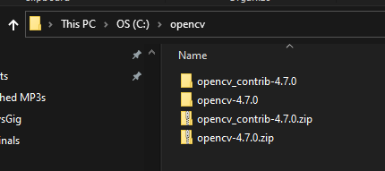
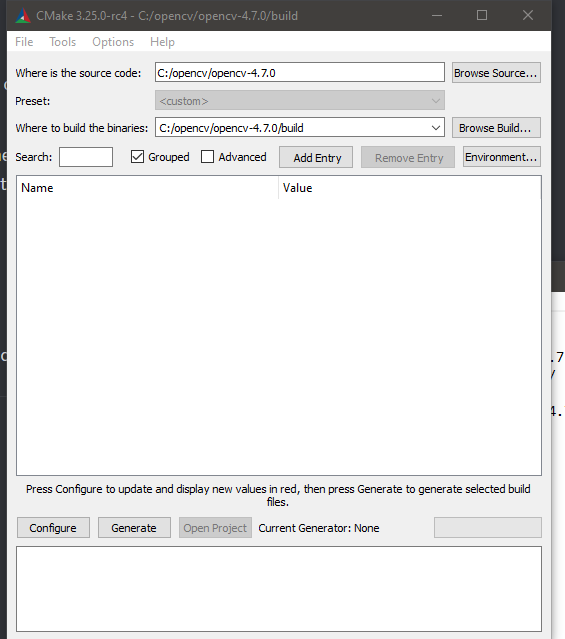
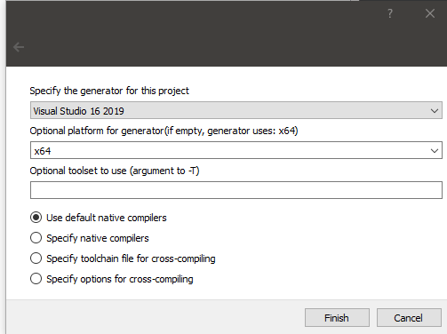
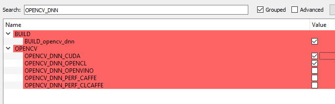
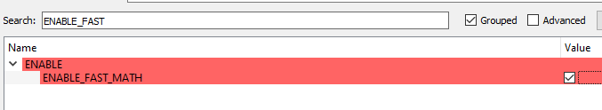
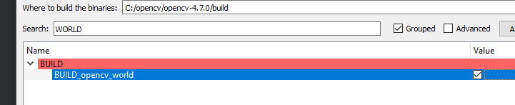
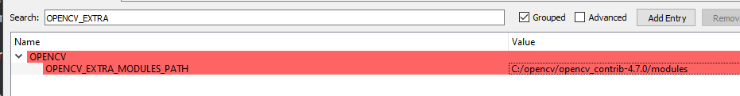
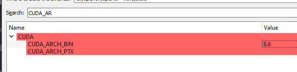
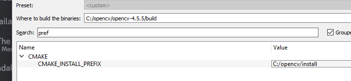
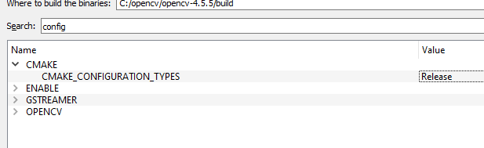

*** Always use git bash for windows

Required tools:

cmake
opencv
cuda
flir camera sdk

OPENCV INSTALL:
0. Install cuda + cudann

1. download opencv source 4.9.0
https://opencv.org/releases/

2. download opencv_contrib 4.9.0

CMAKE gui -> copy this, press configure

Press configure, then set as follows:

Will take a while

Enable cuda

Set extra modules to where you installed opencv_contrib

Hit configure again (verify no errors).

Now set the architecture version. This depends on your gpu so you need to look it up. Mine's 8.6

Set install prefix (I put it in C:/opencv/install)

Remove debug in below (should say only release):

Finally hit generate
Open command prompt and run:

Open RobotController dir in vscode

Make sure you have the Cmake Tools Extension installed

Ctrl + Shift + P -> Cmake Select kit -> Amd64 (or whichever is you)

Then Ctrl + Shift + P -> Cmake Configure

FLIR Camera SDK:
https://www.flir.com/support-center/iis/machine-vision/downloads/spinnaker-sdk-download/?pn=Spinnaker+SDK&vn=Spinnaker_SDK