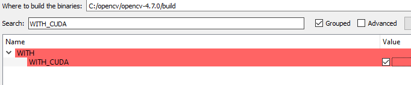
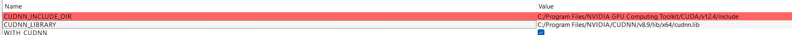
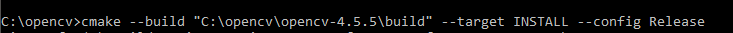

*** Always use git bash for windows

# Build for Real robot:
`./buildRelease.bat`

# Build for Simulation (use vision processing as if real robot):
`./buildRelease.bat SIMULATION`

# Build for Simulation (but force the robot positions / rotations to the sim)
`./buildRelease.bat SIMULATION FORCE_SIM_DATA`

# Configuration Options
`FORCE_SIM_DATA` Enables forcing of the robot position using the received data. Shouldn't be used in real mode

Required tools:

cmake
opencv
cuda
flir camera sdk
visual studio (build tools)
python with numpy

OPENCV INSTALL:
0. Install cuda 12.3 + cudnn v8.9 (As of 5/8/2024 opencv 4.9 does not support newer than this)

1. download opencv source 4.9.0
https://opencv.org/releases/

2. download opencv_contrib 4.9.0

CMAKE gui -> copy this, press configure

Press configure, then set as follows:

Will take a while

Enable cuda

Set extra modules to where you installed opencv_contrib

Hit configure again (verify no errors).

Now set the architecture version. This depends on your gpu so you need to look it up. Mine's 8.6

Set install prefix (I put it in C:/opencv/install)

Remove debug in below (should say only release):

Init submodules: run 'git submodule update --init' inside git repo

Finally hit generate
Open command prompt and run:

Open RobotController dir in vscode

Make sure you have the Cmake Tools Extension installed

Ctrl + Shift + P -> Cmake Select kit -> Amd64 (or whichever is you)

Then Ctrl + Shift + P -> Cmake Configure

FLIR Camera SDK:
https://www.flir.com/support-center/iis/machine-vision/downloads/spinnaker-sdk-download/?pn=Spinnaker+SDK&vn=Spinnaker_SDK