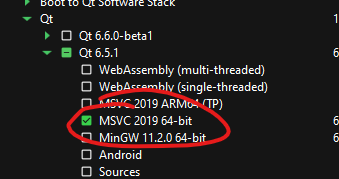
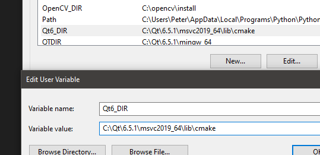

*** Always use git bash for windows

Required tools:

cmake
qt
opencv
cuda

Qt Install:
Download + sign up for educational license of Qt (I'm using version 6.5.1).

** Make sure not to install the mingw one and instead install msvc2019_64:

Add environment variable called Qt6_DIR and set to C:\Qt\6.5.1\msvc2019_64\lib\cmake\Qt6

Also make sure to add to the path environment variable the bin:
C:\Qt\6.5.1\msvc2019_64\bin

OPENCV INSTALL:
0. Install cuda + cudann

1. download opencv source 4.7.0
https://opencv.org/releases/

2. download opencv_contrib 4.7.0

CMAKE gui -> copy this, press configure

Press configure, then set as follows:

Will take a while

Enable cuda
	

Set extra modules to where you installed opencv_contrib

Hit configure again (verify no errors).

Now set the architecture version. This depends on your gpu so you need to look it up. Mine's 8.6

Set install prefix (I put it in C:/opencv/install)

Remove debug in below (should say only release):

Finally hit generate
Open command prompt and run:

